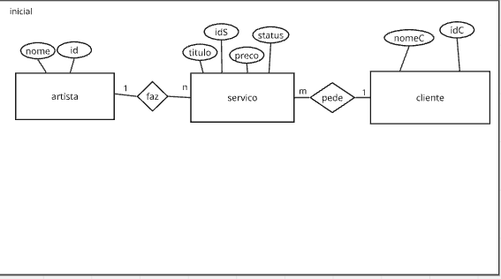
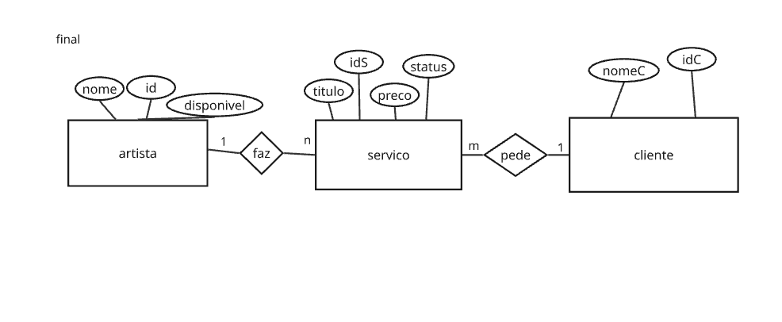

# Tarefa4SQL

Adicionando comandos como ALTER TABLE (para modificar tabelas já criadas), DELETE e ambiente seguro de modificações temporárias (START TRANSACTION, ROLLBACK).

mer inicial:

mer final:

